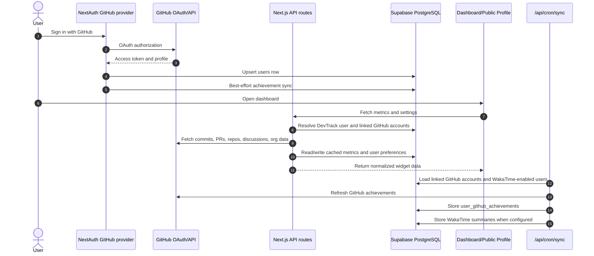
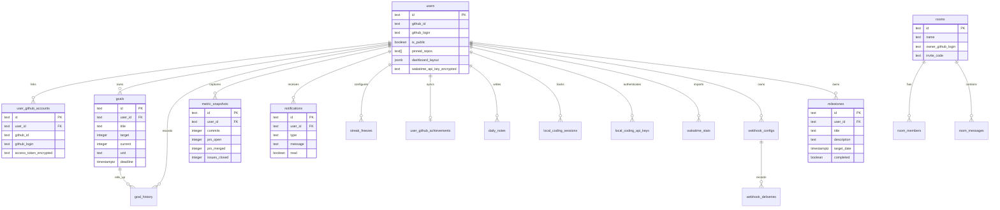

# DevTrack Architecture

This page gives new contributors a map of how DevTrack's pages, API routes,
database tables, and external services work together.

## System Overview

```mermaid
flowchart LR
  user["User browser"]
  vercel["Vercel deployment"]

  subgraph frontend["Next.js App Router frontend"]
    landing["/"]
    dashboard["/dashboard"]
    settings["/dashboard/settings"]
    publicProfile["/u/[username]"]
    personality["/dashboard/personality"]
    careerIntel["/dashboard/career-intelligence"]
    repoHealth["/dashboard/repo-health"]
    repoComparison["/dashboard/repo-comparison"]
    rooms["/rooms"]
    leaderboard["/leaderboard"]
    friendCompare["/friend-compare"]
    projectTutor["/project-tutor"]
    wrapped["/wrapped"]
    apiDocs["/api-docs"]
    widgets["Dashboard widgets and shared components"]
  end

  subgraph api["Next.js route handlers"]
    auth["/api/auth/[...nextauth]\nGitHub OAuth session"]
    metrics["/api/metrics/*\ncontributions, PRs, repos, streak,\nlanguages, achievements, CI, consistency,\ncommunity, repo-health, repo-analytics,\nrepo-explorer, commit-times, productive-hours"]
    goals["/api/goals/*\ngoals, history, sync"]
    userSettings["/api/user/*\nsettings, export, accounts, orgs,\npinned repos, dashboard layout"]
    notifications["/api/notifications/*"]
    publicApi["/api/public/[username]\npublic profile JSON"]
    cron["/api/cron/*\nscheduled sync and weekly digest"]
    webhooks["/api/webhooks/*\nGitHub and custom webhooks"]
    wakatime["/api/wakatime/*"]
    localCoding["/api/local-coding/*\nAPI keys, stats, sync"]
    personality_api["/api/personality\nAI Code Personality Report"]
    aiRoutes["/api/ai/*\nroast, weekly-summary"]
    cvRoutes["/api/cv/*\nanalyze, generate, export"]
    roomsApi["/api/rooms/*\nrooms CRUD, messages, members"]
    milestones["/api/milestones/*"]
    badges["/api/badge/*\nSVG badge endpoints"]
    ogRoutes["/api/og/*\nOG image generation"]
    stream["/api/stream\nSSE real-time push"]
    leaderboardApi["/api/leaderboard/*\nleaderboard and rebuild"]
    jira["/api/integrations/jira/*"]
    wrapped_api["/api/wrapped\nYear in Code data"]
    projectTutorApi["/api/project-tutor\nAI Project Tutor"]
  end

  subgraph data["Supabase PostgreSQL"]
    users[("users")]
    accounts[("user_github_accounts")]
    goalsTable[("goals")]
    history[("goal_history")]
    snapshots[("metric_snapshots")]
    notificationsTable[("notifications")]
    achievements[("user_github_achievements")]
    wakatimeStats[("wakatime_stats")]
    localCoding_db[("local_coding_sessions\nlocal_coding_api_keys")]
    webhookTables[("webhook_configs\nwebhook_deliveries")]
    roomsTables[("rooms\nroom_members\nroom_messages")]
    milestones_db[("milestones")]
    cache[("leaderboard_cache\nai_insights\ndaily_notes")]
  end

  subgraph external["External services"]
    githubOAuth["GitHub OAuth"]
    githubApi["GitHub REST and GraphQL APIs"]
    wakatimeApi["WakaTime API optional"]
    discord["Discord webhooks optional"]
    groq["Groq API optional AI features"]
    anthropic["Anthropic API optional AI summaries"]
    resend["Resend optional email delivery"]
    redis["Upstash Redis optional distributed cache"]
  end

  user --> vercel
  vercel --> landing
  vercel --> dashboard
  vercel --> settings
  vercel --> publicProfile
  vercel --> personality
  vercel --> careerIntel
  vercel --> repoHealth
  vercel --> repoComparison
  vercel --> rooms
  vercel --> leaderboard
  vercel --> friendCompare
  vercel --> projectTutor
  vercel --> wrapped
  dashboard --> widgets
  widgets --> metrics
  widgets --> goals
  widgets --> notifications
  settings --> userSettings
  publicProfile --> publicApi

  auth --> githubOAuth
  auth --> users
  auth --> achievements
  metrics --> githubApi
  metrics --> users
  metrics --> accounts
  metrics --> snapshots
  metrics --> cache
  metrics --> redis
  goals --> goalsTable
  goals --> history
  userSettings --> users
  userSettings --> accounts
  notifications --> notificationsTable
  notifications --> discord
  publicApi --> users
  publicApi --> achievements
  publicApi --> goalsTable
  cron --> accounts
  cron --> achievements
  cron --> wakatimeStats
  cron --> githubApi
  cron --> wakatimeApi
  cron --> resend
  webhooks --> webhookTables
  wakatime --> wakatimeApi
  wakatime --> wakatimeStats
  localCoding --> localCoding_db
  personality_api --> groq
  aiRoutes --> groq
  aiRoutes --> anthropic
  cvRoutes --> groq
  projectTutorApi --> groq
  roomsApi --> roomsTables
  milestones --> milestones_db
  stream --> users
  leaderboardApi --> users
  leaderboardApi --> redis
  jira --> users
```

## GitHub Activity Sync Flow

## Frontend

DevTrack uses the Next.js App Router under `src/app`.

| Area | Files | Purpose |
|---|---|---|
| Landing | `src/app/page.tsx`, `src/components/landing/LandingPage.tsx` | Public marketing and product entry point |
| Auth | `src/app/auth/signin/page.tsx`, `src/app/auth/layout.tsx` | GitHub sign-in UI |
| Dashboard | `src/app/dashboard/page.tsx`, `src/app/dashboard/layout.tsx` | Authenticated developer dashboard |
| Settings | `src/app/dashboard/settings/page.tsx` | Public profile, WakaTime, Discord, pinned repo, and privacy settings |
| Public profile | `src/app/u/[username]/page.tsx` | Shareable profile backed by `/api/public/[username]` |
| Repo views | `src/app/dashboard/repo-health/page.tsx`, `src/app/dashboard/repo-comparison/page.tsx` | Repository analysis experiences |
| AI Personality | `src/app/dashboard/personality/page.tsx` | AI Code Personality Report page |
| Career Intelligence | `src/app/dashboard/career-intelligence/page.tsx` | Career intelligence and CV generation |
| Community | `src/app/leaderboard/page.tsx`, `src/app/rooms/*` | Public leaderboard and collaborative rooms |
| Friend comparison | `src/app/friend-compare/page.tsx` | Side-by-side friend comparison |
| Project Tutor | `src/app/project-tutor/page.tsx` | AI-powered project tutor |
| Year in Code | `src/app/wrapped/page.tsx` | Spotify Wrapped–style year-in-review experience |
| Compare | `src/app/compare/[users]/page.tsx` | Direct URL-based user comparison |

The dashboard is composed from reusable widgets in `src/components`, especially
`src/components/dashboard/CustomizableDashboard.tsx`. Widgets call focused API
routes rather than sharing a large client-side data store. The dashboard layout
is user-customizable and persisted via `/api/user/dashboard-layout`.

## API Routes

Route handlers live in `src/app/api`. DevTrack has 90+ routes across the following groups:

| Route group | Responsibility |
|---|---|
| `/api/auth/[...nextauth]` | GitHub OAuth through NextAuth, JWT session creation, user upsert, token validation |
| `/api/auth/link-github` | Link additional GitHub accounts for multi-account metrics |
| `/api/metrics/*` | 30+ GitHub-derived dashboard metrics: contributions, PRs, repos, issues, languages, streaks, achievements, CI, repo health, repo analytics, repo explorer, discussions, commit times, productive hours, consistency score, community engagement, inactive repos, sponsors, and comparisons |
| `/api/goals/*` | Goal CRUD, goal history, and GitHub-backed goal progress sync |
| `/api/user/*` | Settings, linked accounts, pinned repos, organizations, dashboard layout, data export |
| `/api/notifications/*` | Notification reads, marking read, weekly notifications, Discord sync |
| `/api/public/[username]` | Public profile payload with rate limiting and visibility checks |
| `/api/cron/sync` | Scheduled refresh for WakaTime summaries and GitHub achievements |
| `/api/cron/weekly-digest` | Sends weekly digest emails via Resend |
| `/api/wakatime/*` | Optional WakaTime connection, sync, and disconnection endpoints |
| `/api/webhooks/github` | GitHub push webhook receiver — invalidates affected user's metrics cache |
| `/api/webhooks/custom/*` | User-configured outbound webhooks: CRUD, test, rotate secret, delivery history, retry |
| `/api/webhooks/dispatch/metrics` | Internal: triggers SSE push for real-time dashboard updates |
| `/api/local-coding/*` | Local coding session API keys, stats, and session ingestion |
| `/api/personality` | AI Code Personality Report — deterministic scoring with optional Groq prose |
| `/api/ai/roast` | AI roast or hype of the user's coding style (Groq) |
| `/api/ai/weekly-summary` | AI-generated weekly summary (Groq/Anthropic) |
| `/api/project-tutor` | AI Project Tutor for code and architecture questions (Groq) |
| `/api/cv/*` | CV/resume analysis, AI generation, and export |
| `/api/rooms/*` | Collaborative rooms CRUD, messaging, member management, invite links |
| `/api/milestones/*` | Personal milestone CRUD |
| `/api/leaderboard/*` | Public leaderboard data plus token-protected rebuild endpoint |
| `/api/badge/*` | SVG badge endpoints for embedding in READMEs |
| `/api/og/*` | Open Graph image generation for user profiles and wrapped |
| `/api/wrapped` | Year in Code wrapped data aggregation |
| `/api/stream` | Server-Sent Events endpoint for real-time dashboard pushes |
| `/api/integrations/jira/*` | Jira credential storage and project data fetching |
| `/api/contact` | Contact form submission via Resend |

Most authenticated routes read the NextAuth session with `getServerSession`,
resolve the DevTrack user via `src/lib/resolve-user.ts`, then use the
server-side Supabase admin client from `src/lib/supabase.ts`.

## Database

Supabase PostgreSQL is the primary datastore. The canonical schema and migrations live in `supabase/schema.sql` and `supabase/migrations`.

The diagram is intentionally simplified. Tables for repository health,
leaderboard cache, AI insights, Jira credentials, public widgets, and data
exports are included in migrations but omitted above to keep the onboarding
view readable.

## Components

Components in `src/components/` are organized by feature subdirectory:

| Directory | Contents |
|---|---|
| `src/components/dashboard/` | `CustomizableDashboard`, `DashboardWidgetShell`, `SortableDashboardWidget`, layout toolbar |
| `src/components/career-intelligence/` | `CareerIntelligence`, `ContributionAnalysisPanel`, `ResumePreview`, `RoleSelector`, `ExportPanel` |
| `src/components/personality/` | `PersonalityReport` |
| `src/components/repo-health/` | `RepoHealthCard`, `RepoHealthGauge`, `RepoHealthRadar`, `RepoHealthInsights`, `RepoHealthExplorer` |
| `src/components/repo-analytics/` | `RepoAnalyticsExplorer`, `RepoCard`, `RepoGrid`, `RepoCarousel`, `RepoTimelineChart`, `RepoLanguagePie` |
| `src/components/rooms/` | `CreateRoomModal`, `InviteModal`, `MembersPanel`, `MessageFeed`, `MessageInput` |
| `src/components/leaderboard/` | `LeaderboardFilters` |
| `src/components/landing/` | `LandingPage` |
| `src/components/webhook/` | `WebhookManager` |
| `src/components/ui/` | Primitive components: `button`, `card`, `badge`, `progress`, `select`, `tabs`, `skeleton`, `textarea` |
| `src/components/*.tsx` | Shared widget components used on the dashboard and public profile |

Key shared components include: `AIMentorWidget`, `ContributionGraph`, `ContributionHeatmap`, `StreakTracker`, `PRMetrics`, `GoalTracker`, `MilestonePlanner`, `LocalCodingTime`, `CodingTimeWidget`, `WeeklySummaryCard`, `PersonalRecords`, `CommunityMetrics`, `ConsistencyScoreWidget`, `ProductiveHoursWidget`, `CommitTimeChart`, `DiscussionsWidget`, `InactiveRepositoriesCard`, `DashboardSSEProvider`, `SSEListener`, `NotificationBell`, `WebhookManager`, and more.

## Lib Utilities

Key files in `src/lib/`:

| File | Purpose |
|---|---|
| `auth.ts` | NextAuth config, GitHub scopes, Supabase user upsert on login |
| `metrics-cache.ts` | Two-tier (memory + Redis) TTL cache with `withMetricsCache` helper |
| `leaderboard-cache.ts` | TTL helper functions for leaderboard cache entries |
| `response-cache.ts` | `privateCacheHeaders` / `publicCacheHeaders` for HTTP `Cache-Control` |
| `redis-cache-helper.ts` | Simple Upstash Redis `getCachedData` / `setCachedData` helpers |
| `personality-analysis.ts` | Deterministic personality dimension scoring from GitHub metrics |
| `ai-mentor.ts` | AI mentor prompt orchestration |
| `ai-prompts.ts` | Shared prompt templates for Groq/Anthropic calls |
| `cv/` | CV generation: AI generator, classifier, GitHub data fetcher, prompts |
| `sse.ts` | In-process SSE connection registry; `sendSSEEvent` for webhook dispatch |
| `rooms.ts` | Room username normalization helpers |
| `jira-utils.ts` | Jira credential encryption and API helpers |
| `ssrf-protection.ts` | DNS-based SSRF validation for custom webhook target URLs |
| `sanitize.ts` | Input sanitization helpers |
| `crypto.ts` | AES-256-GCM encryption/decryption for OAuth tokens |
| `supabase.ts` | Supabase admin client (server-only) |
| `resolve-user.ts` | Resolve NextAuth session to DevTrack Supabase user |
| `github.ts` | GitHub REST API client helpers |
| `github-accounts.ts` | Multi-account GitHub API helpers |
| `repo-health.ts` | Repository health score calculation |
| `webhooks.ts` | Custom webhook HMAC signing and HTTP dispatch |

## External Services

| Service | Used by | Notes |
|---|---|---|
| GitHub OAuth | NextAuth provider in `src/lib/auth.ts` | Primary sign-in and access-token source |
| GitHub REST/GraphQL APIs | `src/lib/github*.ts`, `/api/metrics/*`, `/api/cron/sync` | Fetches commits, PRs, repos, achievements, discussions, orgs, and profile data |
| Vercel | App hosting | Runs the Next.js frontend and route handlers |
| Supabase | Database and RLS | Stores users, preferences, linked accounts, goals, notifications, rooms, and cached data |
| Upstash Redis | `src/lib/metrics-cache.ts`, `src/lib/redis-cache-helper.ts` | Optional distributed cache for metrics; app degrades gracefully without it |
| WakaTime | `/api/wakatime/*`, `/api/cron/sync` | Optional coding-time import when a user stores an encrypted API key |
| Discord | Notification settings | Optional webhook delivery for reminders and alerts |
| Groq | AI routes | Optional AI summaries, personality reports, project tutor, CV generation |
| Anthropic | `/api/ai/weekly-summary` | Optional AI-generated weekly summaries |
| Resend | `/api/contact`, `/api/cron/weekly-digest` | Contact form delivery and weekly digest emails |

## Operational Notes

- GitHub OAuth tokens are held in the NextAuth JWT session. Additional linked
  account tokens are encrypted with AES-256-GCM before storage in `user_github_accounts`.
- GitHub API fetches use `cache: "no-store"` to prevent Next.js from caching
  responses tied to a specific user's OAuth token.
- Public profile responses are gated by `users.is_public` and rate limited in
  `/api/public/[username]`.
- Metrics routes use `withMetricsCache` from `src/lib/metrics-cache.ts` to
  reduce GitHub API pressure. The cache checks in-process memory first, then
  falls back to Upstash Redis when configured.
- Scheduled sync work runs through `/api/cron/sync` and `/api/cron/weekly-digest`,
  both protected by a `CRON_SECRET` Bearer token.
- Real-time dashboard updates are pushed via SSE (`/api/stream`). Webhook
  dispatch calls `sendSSEEvent` from `src/lib/sse.ts` to notify the connected
  client without a polling cycle.
- Custom webhook target URLs are validated against SSRF attack vectors using
  `src/lib/ssrf-protection.ts` before dispatch.
- Server-only Supabase access should go through `supabaseAdmin`; browser code
  should use public/anon-safe clients only.
